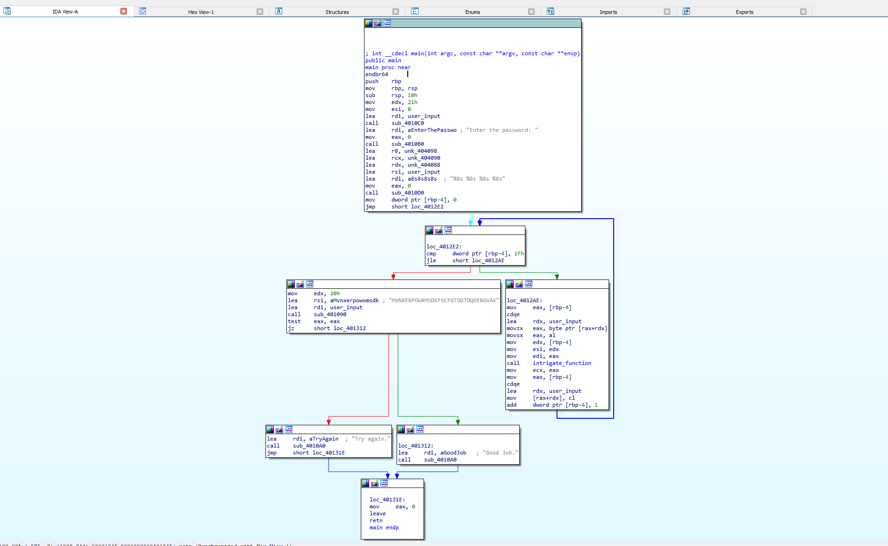
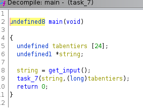
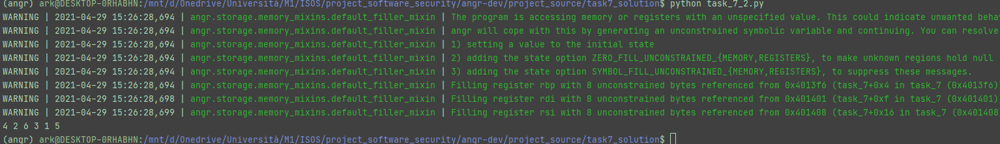

# ANGR PROJECT - FINAL REPORT

## Author : Khaled ARSALANE

## task1 :

> In order to solve the challenge, let's use ``angr`` and explore the path that leads to the `print` of the **success** message 
>
> I first dumped the code with ``objdump -d task_1`` and looked for the **main** function
> 
> By looking at the function, I noticed that a comparison occurs at address **0x401214** (a call to ``strcmp()`` is made)
> 
> The call of the function is followed by a 'result' check (at address **0x40121c**) -> ``if strcmp() == 0`` 
> 
> The result of this function indicates if its two string arguments are equal : in fact, our input is tested here! The password must be nearby...
> 
> At address **0x401220** a jump is taken to address **0x401230** if the two compared strings are not equal, so the address we are looking for must be in between
> 
> Indeed, at address **0x401229** a call to ``puts`` is made, this must be the good path!
> 
> So after providing this address to, I could find the same flag as lab_4 : **250382**

## task2 :

> First I've started fuzzing a little with the parameters of the program
>
> I've noticed that for different size of input, different messages are shown (let's keep that in mind for later)
> 
> An inspection of the disassembled binary didn't provide anything of interest (a lot of comparison and jumps are made, A LOT...) except that two parameters from the command line are loaded into %rsi
> 
> Also, argc is loaded in %edi and is used at address 0x401169 to check if we provided correctly 2 arguments 
> 
> So let's set up an ``angr`` script by importing the claripy module (it will be used to handle the two params)
>  
> During testing of the binary, i noticed that two odd numbers, each one greater than 7, make something interesting.
> 
> So i've created two symbolic bitvector or BVS, one for each argument
> 
> By doing `strings` on the program, we can dump the messages that are printed to the user. We notice here a message that is likely to be printed upon successful input of arguments.
> 
> The message is : **Abby & Gabby: yaayy!! nice job! :D**
> 
> By looking the program via IDA Pro we can also notice how the transition between blocks are made 
> 
> 
> 
> The message we are looking for is called at address **0x4012C3** 
> 
> 
> 
> So lets setup angr with these informations
> 
> At the first run of the program a solution is found, however the provided characters don't seem to work (the solver provided 0 0 as solution)
> 
> Since the parameters are provided from the command line and since the command line handles strings, here we need to add some constraints to the BVS so that angr will output only characters between 0 and 9
> 
> And voilà, the flag is ``00001111`` and ``00000000``
>

## task3 :

> By running the binary the first time, i noticed that the required input was behaving weirdly
> 
> First things first, i've run an ``objdump -d`` in order to disassemble the binary and i've noticed that actually four parameters are used before teh call to scanf (%rdi register is used for the format string)
>
    401278:       4c 8d 05 19 2e 00 00    lea    0x2e19(%rip),%r8        # 404098 <user_input+0x18>
    40127f:       48 8d 0d 0a 2e 00 00    lea    0x2e0a(%rip),%rcx        # 404090 <user_input+0x10>
    401286:       48 8d 15 fb 2d 00 00    lea    0x2dfb(%rip),%rdx        # 404088 <user_input+0x8>
    40128d:       48 8d 35 ec 2d 00 00    lea    0x2dec(%rip),%rsi        # 404080 <user_input>

> We can also notice that there is an offset of 8 between each parameter, that must be the size of the required input
> 
> This theory is also confirmed after a run of ``strings`, where we can find

    Try again.
    Enter the password:
    %8s %8s %8s %8s <-- input formatting for scanf
    MVNXERPOWXMSDKFSCFGTODTDQOERGVAK <-- this might be the password heeh
    Good Job.

> Another interesting thing is the call to the function **intrigate_function**
> 
> By looking at the program from IDA Pro
> 
> 
> 
> We notice that indeed we are looking at four 8-char long words in capital letters (that can helps us define the range that we need to solve for each character of the word) 
> 
> Same as the previous challenge, we need to setup symbolic bitvectors in order to emulate user input
> 
> Each BVS is 64 bit long and it will represent the location in memory where the user input is stored
> 
> Since we know that the passwords are all capital letters, we can add this as a constraint
> 
> The output message that we are looking for is the one that says **Good Job.** and during the reconnaissance phase I found out that the address is at 0x401312 (target)[target.PNG]
> 
> Once the correct simulation is found, we can evaluate which characters respect our constraints 
>
> And the result flag is ``MMVWUYND CUAXZXJN OIAEQWDE IXEIOUQR``

## task4 :

> After the first inspections of file with `strings` and `objdump`, I've noticed that the program takes an input from stdin via **scanf**
    
    Try again.
    Enter the password:
    %8s %8s
    KDFDROPF <<---- password1
    MCQZIDFK <<---- password2
    Good Job. <<----target message

> two 8-characters long words are required (since a call to scanf(%8s %8s) is made)
> 
> Also I've notice that some memory is allocated , and possibly it interacts with the user input
> 
> On IDA Pro the binary looks like this 
> 
> 
> 
> The address that we will be targeting is : **0x4013EA**
> 
> Same as before, I will chose as entry point the address one instruction after the call to scanf ->   **0x40131c**
> 
> Since we are starting the program after the call to scanf, the buffers that will store the user input will not be allocated
> 
> In order to do so, we have to simulate the heap memory inside angr 
> 
> So I've retrieved the addresses of the pointers to the buffer from the disassembled binary and made these addresses point to a random address that will fake the heap inside of angr
> 
> Then, I've created two symbolic bitvectors that represent the user input and filled the fake memory with the BVS
> 
> Since I knew from reconnaissance that the characters are capital letters, I could add some constraints on the results
> 
> Once started the program finds the following values ``KQFQRBPS MPQMIQFX``

## task5 :

> As usual, some helpful data with ``strings``

    giants
    isrveawhobpnutfg
    Enter the password:
    %6s %6s << interesting

> Also in this binary multiple functions are called, here is an overview from IDA Pro
> 
> This time there is no success message, so I'll try to avoid the error message
> 
> What's also interesting is the use of the functions **str_len** and **str_eq** which seem to behave the same as **strlen** and **strncmp**
> 
> So I've put two hooks for these two functions, added constraints for the input (we are looking for 12 small letters)
> 
> And the found flag is ``oaekmaobekma``

## task6 :

> During the binary exploration, I've noticed that the program is looking for 6 integers

    To decieve your ennemy, begin with your ally!
    Please try again!
    Error: Input line too long
    %d %d %d %d %d %d

> Also by looking at the binary I noticed the function ``read_six_numbers`` which seems to mimic the behaviour of the function **scanf**
> 
> So instead of trying to manipulate this function directly, I've tried to manipulate its result just after its execution
> 
> That means : storing symbolic values that represent the 6 integers directly in the stack just after the call to the function
> 
> 
> 
> Here we will have our entry point. It seems also that at this instruction a comparison is made with **1** with rbp-020h (presumebly where the integers are stored because at the beginning of task6 the stack is decreased)
>
> Since the stack is decreased by 0x40, it means that the integers are stored at the following addressess
    
    rbp-0x34
    rbp-0x30
    rbp-0x2C
    rbp-0x28
    rbp-0x24
    rbp-0x20 -> this one being the value 1 from the instruction `cmp [rbp-20h], 1`

> Here we can simply represent the 6 integers by one BVS that is pushed in the stack right where the first integer was supposed to be
> 
> Inversely, the solution is extracted by popping the 3 bytes each one designating two integers
> 
> The address that we want to reach is the end of the function **task_6** and the addresses that we want to avoid are the one that lead to the print of the message **try again.**
> 
> The flag is : ``1 2 6 24 120 720``

## task7 :

> This challege seemed to be similar to task6 so I thought that I could reuse my previous solution 
> 
> However it didn't work as expected, so I've started exploriing the binary with **gdb peda**
> 
> Here I noticed that the integers are not directly pushed in the stack as before :
> 
> I've put a breakpoint just after the call to **read_six_numbers** and explored the memory to see where the integers where stored
> 
> Here we can see that the integers are stored starting from **$rbp+0x10**
> 
> 
> 
> So I've thought of using this address on angr in order to store the BVS representing the integers.
> 
> Unfortunately it didn't work as expected.
> 
> So I've explored again the binary, this time with ghidra and I noticed some differences from task_6:
> 
> - First of all, the array of integers (where our input will be stored) is located in **main** (while in task_6 it was located in the function **task_6**)
> 
>   
> 
> - Then the reference to this array is then passed to **task_7**
> 
>   
> 
> - Which is then passed to **read_six_numbers** (that acts as a call to **scanf**)
>
> So I've tried to put a hook on the call to the function **read_six_numbers** and manually recreate its behaviour
> 
> Since the goal of this function is just to format and store the string input inside the array, then we can recreate a procedure that does the same thing except we will be skipping the ""string"" part and we will be using the second parameter of the function (which is the address of the array in **main**) as a location where the BVS will be stored
> 
> As usual, the avoid addresses will be the ones pointing to the error message
> 
> And the goal is to reach the exit of the function
> 
> Since the function **task_7** is full of loops that can drastically increase the execution time of angr (due to path explosion), activating the option **veritesting** of the simulation manager helps mitigate this problem.
> 
> [**Veritesting**](https://users.ece.cmu.edu/~dbrumley/pdf/Avgerinos%20et%20al._2014_Enhancing%20Symbolic%20Execution%20with%20Veritesting.pdf) combines dynamic symbolic execution (for path exploration) with static symbolic execution(for loops that don't contain syscalls, indirect jumps or other scenarios difficult to handle). By doing so, some paths are treated like a logical expression, which makes binary exploration much easier.
> 
> Finally, by executing the script the flag is found in less that 20 seconds!! (instead of the estimated 7 minutes). 
> 
> 

