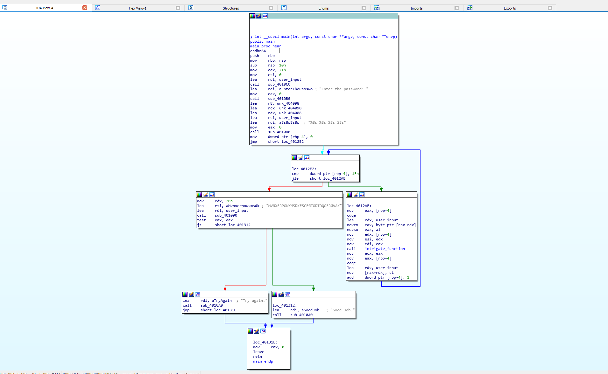

# ANSWERS

## task3 :

> By running the binary the first time, i noticed that the required input was behaving weirdly
> 
> First things first, i've run an ``objdump -d`` in order to disassemble the binary and i've noticed that actually four parameters are used before teh call to scanf (%rdi register is used for the format string)
>
    401278:       4c 8d 05 19 2e 00 00    lea    0x2e19(%rip),%r8        # 404098 <user_input+0x18>
    40127f:       48 8d 0d 0a 2e 00 00    lea    0x2e0a(%rip),%rcx        # 404090 <user_input+0x10>
    401286:       48 8d 15 fb 2d 00 00    lea    0x2dfb(%rip),%rdx        # 404088 <user_input+0x8>
    40128d:       48 8d 35 ec 2d 00 00    lea    0x2dec(%rip),%rsi        # 404080 <user_input>

> We can also notice that there is an offset of 8 between each parameter, that must be the size of the required input
> 
> This theory is also confirmed after a run of ``strings`, where we can find

    Try again.
    Enter the password:
    %8s %8s %8s %8s <-- input formatting for scanf
    MVNXERPOWXMSDKFSCFGTODTDQOERGVAK <-- this might be the password heeh
    Good Job.

> Another interesting thing is the call to the function **intrigate_function**
> 
> By looking at the program from IDA Pro, 
> 
> We notice that indeed we are looking at four 8-char long words in capital letters (that can helps us define the range that we need to solve for each character of the word) 
> 
> Same as the previous challenge, we need to setup symbolic bitvectors in order to emulate user input
> 
> Each BVS is 64 bit long and it will represent the location in memory where the user input is stored
> 
> Since we know that the passwords are all capital letters, we can add this as a constraint
> 
> The output message that we are looking for is the one that says **Good Job.** and during the reconnaissance phase I found out that the address is at 0x401312 (target)[target.PNG]
> 
> Once the correct simulation is found, we can evaluate which characters respect our constraints 
>
> And the result flag is ``MMVWUYND CUAXZXJN OIAEQWDE IXEIOUQR``
