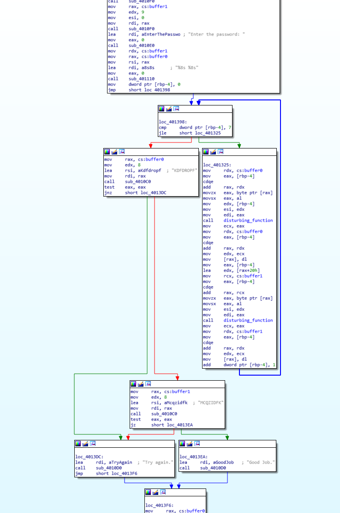

# ANSWERS

## task4 :

> After the first inspections of file with `strings` and `objdump`, I've noticed that the program takes an input from stdin via **scanf**
    
    Try again.
    Enter the password:
    %8s %8s
    KDFDROPF <<---- password1
    MCQZIDFK <<---- password2
    Good Job. <<----target message

> two 8-characters long words are required (since a call to scanf(%8s %8s) is made)
> 
> Also I've notice that some memory is allocated , and possibly it interacts with the user input
> 
> On IDA Pro the binary looks like this 
> 
> The address that we will be targeting is : **0x4013EA**
> 
> Same as before, I will chose as entry point the address one instruction after the call to scanf ->   **0x40131c**
> 
> Since we are starting the program after the call to scanf, the buffers that will store the user input will not be allocated
> 
> In order to do so, we have to simulate the heap memory inside angr 
> 
> So I've retrieved the addresses of the pointers to the buffer from the disassembled binary and made these addresses point to a random address that will fake the heap inside of angr
> 
> Then, I've created two symbolic bitvectors that represent the user input and filled the fake memory with the BVS
> 
> Since I knew from reconnaissance that the characters are capital letters, I could add some constraints on the results
> 
> Once started the program finds the following values ``KQFQRBPS MPQMIQFX``
> 
