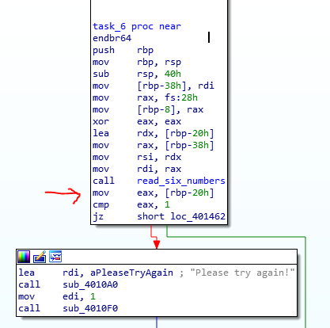

#ANSWERS

##task6 :

> During the binary exploration, I've noticed that the program is looking for 6 integers
> 
    To decieve your ennemy, begin with your ally!
    Please try again!
    Error: Input line too long
    %d %d %d %d %d %d

> Also by looking at the binary I noticed the function ``read_six_numbers`` which seems to mimic the behaviour of the function **scanf**
> 
> So instead of trying to manipulate this function directly, I've tried to manipulate its result just after its execution
> 
> That means : storing symbolic values that represent the 6 integers directly in the stack just after the call to the function
> 
> 
> 
> Here we will have our entry point. It seems also that at this instruction a comparison is made with **1** with rbp-020h (presumebly where the integers are stored because at the beginning of task6 the stack is decreased)
>
> Since the stack is decreased by 0x40, it means that the integers are stored at the following addressess
    
    rbp-0x34
    rbp-0x30
    rbp-0x2C
    rbp-0x28
    rbp-0x24
    rbp-0x20 -> this one being the value 1 from the instruction `cmp [rbp-20h], 1`

> Here we can simply represent the 6 integers by one BVS that is pushed in the stack right where the first integer was supposed to be
> 
> Inversely, the solution is extracted by popping the 3 bytes each one designating two integers
> 
> The address that we want to reach is the end of the function **task_6** and the addresses that we want to avoid are the one that lead to the print of the message **try again.**
> 
> The flag is : ``1 2 6 24 120 720`` 