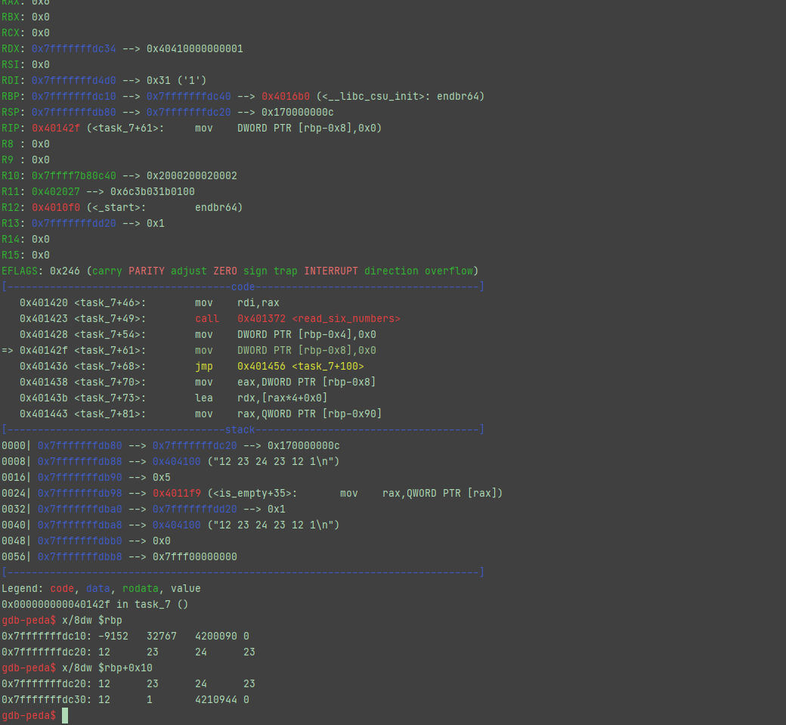
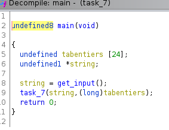
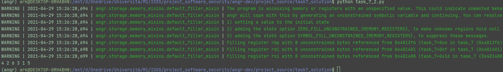

#ANSWERS

##task7 :

> This challege seemed to be similar to task6 so I thought that I could reuse my previous solution 
> 
> However it didn't work as expected, so I've started exploriing the binary with **gdb peda**
> 
> Here I noticed that the integers are not directly pushed in the stack as before :
> 
> I've put a breakpoint just after the call to **read_six_numbers** and explored the memory to see where the integers where stored
> 
> Here we can see that the integers are stored starting from **$rbp+0x10**
> 
> 
> 
> So I've thought of using this address on angr in order to store the BVS representing the integers.
> 
> Unfortunately it didn't work as expected.
> 
> So I've explored again the binary, this time with ghidra and I noticed some differences from task_6:
> 
> - First of all, the array of integers (where our input will be stored) is located in **main** (while in task_6 it was located in the function **task_6**)
> 
>   
> 
> - Then the reference to this array is then passed to **task_7**
> 
>   
> 
> - Which is then passed to **read_six_numbers** (that acts as a call to **scanf**)
>
> So I've tried to put a hook on the call to the function **read_six_numbers** and manually recreate its behaviour
> 
> Since the goal of this function is just to format and store the string input inside the array, then we can recreate a procedure that does the same thing except we will be skipping the ""string"" part and we will be using the second parameter of the function (which is the address of the array in **main**) as a location where the BVS will be stored
> 
> As usual, the avoid addresses will be the ones pointing to the error message
> 
> And the goal is to reach the exit of the function
> 
> Since the function **task_7** is full of loops that can drastically increase the execution time of angr (due to path explosion), activating the option **veritesting** of the simulation manager helps mitigate this problem.
> 
> [**Veritesting**](https://users.ece.cmu.edu/~dbrumley/pdf/Avgerinos%20et%20al._2014_Enhancing%20Symbolic%20Execution%20with%20Veritesting.pdf) combines dynamic symbolic execution (for path exploration) with static symbolic execution(for loops that don't contain syscalls, indirect jumps or other scenarios difficult to handle). By doing so, some paths are treated like a logical expression, which makes binary exploration much easier.
> 
> Finally, by executing the script the flag is found in less that 20 seconds!! (instead of the estimated 7 minutes). 
> 
> 

